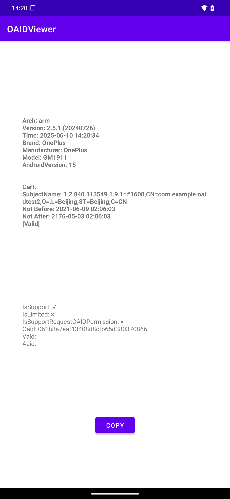

# Heytap-OAID的Mock服务

用于解决Oppo、一加设备刷入非国产系统后无法获取到OAID进而导致的一些问题

模拟一个`OPEN_ID_SERVICE`返回一个随机字符串，生成规则没有与真正的服务匹配

此项目仅用于学习、研究，不可用于生产环境

## 效果

| APP | OAID |
| --- | --- |
| |  |

## 已知问题

1.1.0 及以前版本无法 MOCK